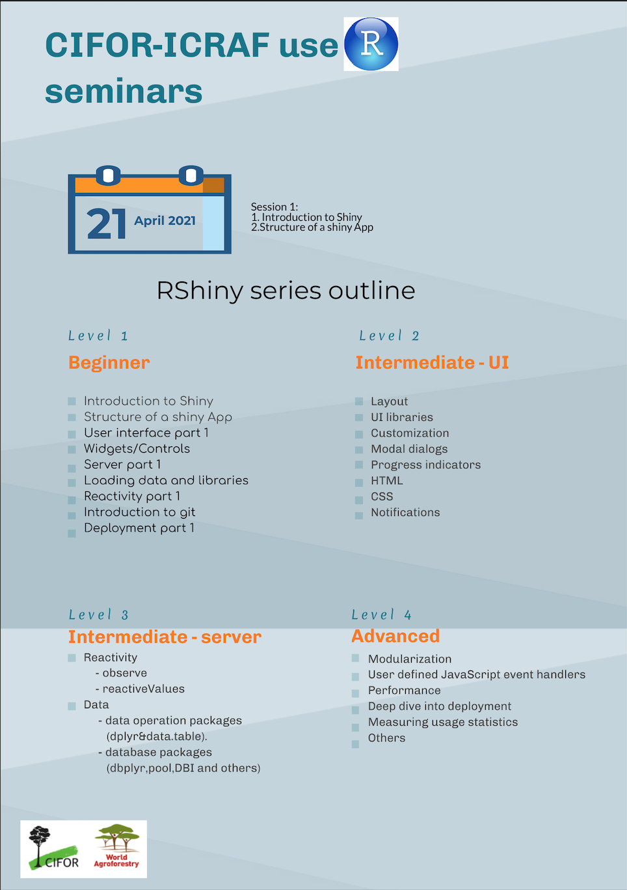

# CIFOR-ICRAF Shiny Seminars  

The CIFOR-ICRAF Spatial Data Science & Applied Learning Lab (SPACIAL) team is pleased to announce the restart of our R Statistics seminar series by introducing the R Shiny library for building user interfaces entirely in R. This library gives you a great way to create small (or large) local (or online) applications and tools, including interactive documents. Shiny was originally released in 2012 and now has a large group of users from around the world.  

We will start the new seminar series on 21st April 2021. The initial seminar will introduce RStudio and Shiny and will be followed by bi-weekly seminars where we will jointly build Shiny applications, introducing more advanced topics and features as we go, as summarised in the attached outline of the sessions.  
 
We hope that as many of you as possible can join.  

Best wishes,

The CIFOR-ICRAF SPACIAL team

